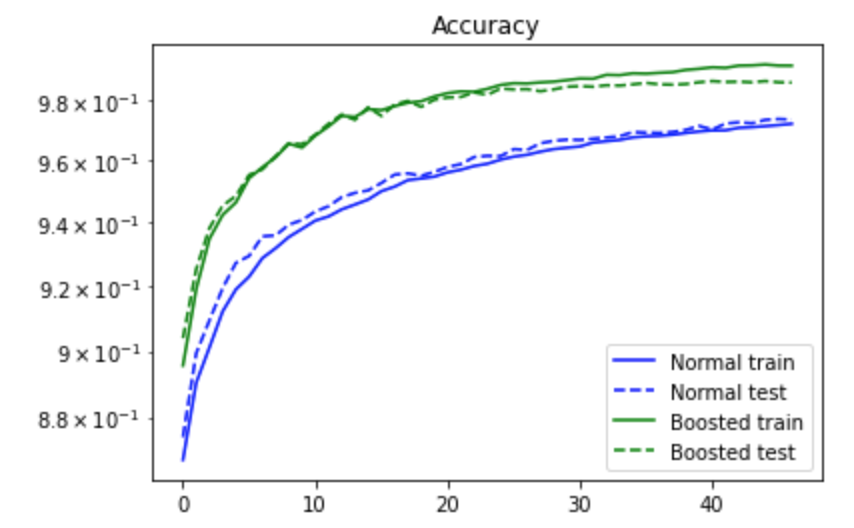
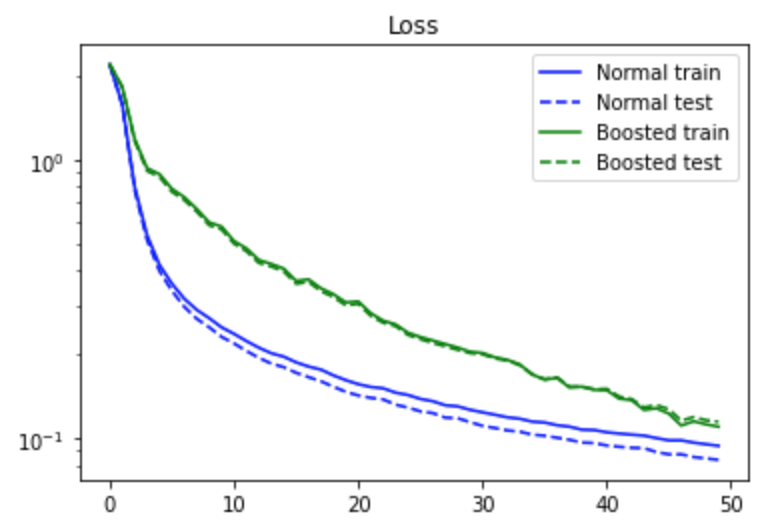
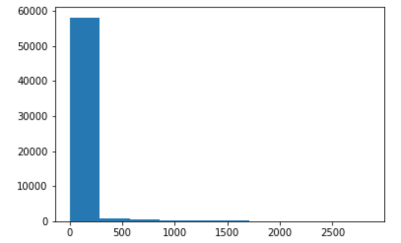

# Boosting Neural Networks
A simple model for MNIST using boosting during training significantly outperforms the equivalent model trained normally in accuracy, but performs worse at minimising the loss.

### Accuracy

### Loss

### Distribution of number of times each data point is used during training

## Approach
Instead of using all data points in each training epoch, we always train on the ones with the previously highest loss. 
In particular, we store the loss value for each data point after each training step, and choose the ones with the highest loss as the next batch for training.
